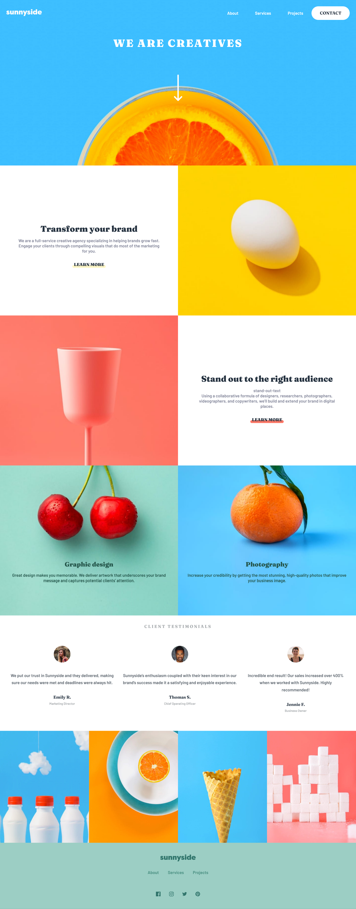

# Frontend Mentor - Sunnyside agency landing page solution

This is a solution to the [Sunnyside agency landing page challenge on Frontend Mentor](https://www.frontendmentor.io/challenges/sunnyside-agency-landing-page-7yVs3B6ef). Frontend Mentor challenges help you improve your coding skills by building realistic projects.

## Table of contents

- [Frontend Mentor - Sunnyside agency landing page solution](#frontend-mentor---sunnyside-agency-landing-page-solution)
  - [Table of contents](#table-of-contents)
  - [Overview](#overview)
    - [The challenge](#the-challenge)
    - [Screenshot](#screenshot)
    - [Links](#links)
  - [My process](#my-process)
    - [Built with](#built-with)
    - [What I learned](#what-i-learned)
    - [Useful resources](#useful-resources)
  - [Author](#author)

**Note: Delete this note and update the table of contents based on what sections you keep.**

## Overview

### The challenge

Users should be able to:

- View the optimal layout for the site depending on their device's screen size
- See hover states for all interactive elements on the page

### Screenshot

**Desktop**



**Mobile**


### Links

- Solution URL: [github](https://github.com/gylim0604/FrontEndMentor-sunnyside-agency)
- Live Site URL: [Vercel](https://front-end-mentor-sunnyside-agency.vercel.app/)

## My process

### Built with

- Semantic HTML5 markup
- Flexbox
- Mobile-first workflow
- SASS

### What I learned

Learnt how to make somewhat responsive images using the picture and source attributes in html. Think that most of the major browsers support it now, will be something useful to know. Still trying to figure out img srcset tho, no idea how to make that work the way I want. 

Example of picture: 

```html
<picture>
  <source media="(max-width: 768px)" srcset="images/mobile/image-photography.jpg"">
  <source media="(min-width: 769px)" srcset="images/desktop/image-photography.jpg">
  
</picture>
```
Feel like my animations are slowly improving. At least I can do simple animations now without looking it up. Hopefully...

Still feel I need to improve my planning skils, I don't really structure with extra wide screens in mind, and haven't figure out a good way to limit the width of the content in extra wide layouts. Need to keep researching of a good way to do it.

Still kinda struggling with svgs, don't think I fully understand them enough to use them extremely efficiently. Definetly something to look into. 

### Useful resources

- [CSS Tricks](https://css-tricks.com/change-color-of-svg-on-hover/) - This helped me figure out a work around on changing the color of svgs. Not the best way, but it works. 
- [MDN Web Docs](https://developer.mozilla.org/en-US/docs/Learn/HTML/Multimedia_and_embedding/Responsive_images) - This helped me understand how to use the picture tags for more control over my responsive images. 

## Author

- Frontend Mentor - [@gylim0604](https://www.frontendmentor.io/profile/gylim0604)

